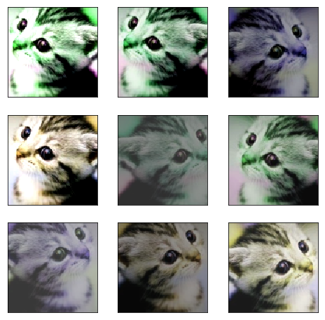

# Compose组合***

transforms包含了一些常用的图像变换，这些变换能够用`Compose`串联组合起来

```python
torchvision.transforms.Compose(transforms)
# 用于把一系列变换组合到一起。
# 参数：transforms（list或Transform对象）- 一系列需要进行组合的变换。

>>> transforms.Compose([
>>>     transforms.CenterCrop(10),
>>>     transforms.ToTensor(),
>>> ])
```

主要从官方文档中总结而来，官方文档只是将方法陈列，没有归纳总结，顺序很乱，这里总结一共有四大类，方便大家索引：
裁剪——Crop
中心裁剪：transforms.CenterCrop
随机裁剪：transforms.RandomCrop
随机长宽比裁剪：transforms.RandomResizedCrop
上下左右中心裁剪：transforms.FiveCrop
上下左右中心裁剪后翻转，transforms.TenCrop

翻转和旋转——Flip and Rotation
依概率p水平翻转：transforms.RandomHorizontalFlip(p=0.5)
依概率p垂直翻转：transforms.RandomVerticalFlip(p=0.5)
随机旋转：transforms.RandomRotation

图像变换
resize：transforms.Resize
标准化：transforms.Normalize
转为tensor，并归一化至[0-1]：transforms.ToTensor
填充：transforms.Pad
修改亮度、对比度和饱和度：transforms.ColorJitter
转灰度图：transforms.Grayscale
线性变换：transforms.LinearTransformation()
仿射变换：transforms.RandomAffine
依概率p转为灰度图：transforms.RandomGrayscale
将数据转换为PILImage：transforms.ToPILImage
transforms.Lambda：Apply a user-defined lambda as a transform.

对transforms操作，使数据增强更灵活
transforms.RandomChoice(transforms)， 从给定的一系列transforms中选一个进行操作
transforms.RandomApply(transforms, p=0.5)，给一个transform加上概率，依概率进行操作
transforms.RandomOrder，将transforms中的操作随机打乱

#  一、 裁剪——Crop
## 1.随机裁剪：transforms.RandomCrop
```
class torchvision.transforms.RandomCrop(size, padding=None, pad_if_needed=False, fill=0, padding_mode=‘constant’)
```

功能：依据给定的size随机裁剪
参数：
size- (sequence or int)，若为sequence,则为(h,w)，若为int，则(size,size)
padding-(sequence or int, optional)，此参数是设置填充多少个pixel。
当为int时，图像上下左右均填充int个，例如padding=4，则上下左右均填充4个pixel，若为$32* 32$，则会变成$40*40$。
当为sequence时，若有2个数，则第一个数表示左右扩充多少，第二个数表示上下的。当有4个数时，则为左，上，右，下。
fill- (int or tuple) 填充的值是什么（仅当填充模式为constant时有用）。int时，各通道均填充该值，当长度为3的tuple时，表示RGB通道需要填充的值。
padding_mode- 填充模式，这里提供了4种填充模式，1.constant，常量。2.edge 按照图片边缘的像素值来填充。3.reflect  4. symmetric

## 2.中心裁剪：transforms.CenterCrop***
```
class torchvision.transforms.CenterCrop(size)
```

功能：依据给定的size从中心裁剪
参数：
size- (sequence or int)，需要裁剪出的形状,如果size是int，将会裁剪成正方形；如果是形如(h, w)的序列，将会裁剪成矩形。

## 3.随机长宽比裁剪 transforms.RandomResizedCrop
```
class torchvision.transforms.RandomResizedCrop(size, scale=(0.08, 1.0), ratio=(0.75, 1.3333333333333333), interpolation=2)
```

功能：随机大小，随机长宽比裁剪原始图片，最后将图片resize到设定好的size
参数：
size- 输出的分辨率
scale- 随机crop的大小区间，如scale=(0.08, 1.0)，表示随机crop出来的图片会在的0.08倍至1倍之间。
ratio- 随机长宽比设置
interpolation- 插值的方法，默认为双线性插值(PIL.Image.BILINEAR)

## 4.上下左右中心裁剪：transforms.FiveCrop
```
class torchvision.transforms.FiveCrop(size)
```

功能：对图片进行上下左右以及中心裁剪，获得5张图片，返回一个4D-tensor
参数：
size- (sequence or int)，若为sequence,则为(h,w)，若为int，则(size,size)

## 5.上下左右中心裁剪后翻转: transforms.TenCrop
```
class torchvision.transforms.TenCrop(size, vertical_flip=False)

```

功能：对图片进行上下左右以及中心裁剪，然后全部翻转（水平或者垂直），获得10张图片，返回一个4D-tensor。
参数：
size- (sequence or int)，若为sequence,则为(h,w)，若为int，则(size,size)
vertical_flip (bool) - 是否垂直翻转，默认为flase，即默认为水平翻转

# 二、翻转和旋转——Flip and Rotation
## 6.依概率p水平翻转transforms.RandomHorizontalFlip
```
class torchvision.transforms.RandomHorizontalFlip(p=0.5)
```

功能：依据概率p对PIL图片进行水平翻转
参数：
p- 概率，默认值为0.5

## 7.依概率p垂直翻转transforms.RandomVerticalFlip
```
class torchvision.transforms.RandomVerticalFlip(p=0.5)
```

功能：依据概率p对PIL图片进行垂直翻转
参数：
p- 概率，默认值为0.5

## 8.随机旋转：transforms.RandomRotation
```
class torchvision.transforms.RandomRotation(degrees, resample=False, expand=False, center=None)
```

功能：依degrees随机旋转一定角度
参数：
degress- (sequence or float or int) ，若为单个数，如 30，则表示在（-30，+30）之间随机旋转
若为sequence，如(30，60)，则表示在30-60度之间随机旋转
resample- 重采样方法选择，可选 PIL.Image.NEAREST, PIL.Image.BILINEAR, PIL.Image.BICUBIC，默认为最近邻
expand- ?
center- 可选为中心旋转还是左上角旋转

# 三、图像变换
## 9.resize：transforms.Resize
```
class torchvision.transforms.Resize(size, interpolation=2)
```

功能：重置图像分辨率
参数：

- **size**（*序列* *或* [*int*](https://docs.python.org/3/library/functions.html#int)）– 期望输出形状。如果size形如（h, w），输出就以该形状。If size is an int, ==smaller edge== of the image will be matched to this number. i.e, if height > width, then image will be rescaled to (size * height / width, size).可以保持原来的宽高比
- interpolation- 插值方法选择，默认为PIL.Image.BILINEAR

## 10.标准化：transforms.Normalize***
```
torchvision.transforms.Normalize(mean, std, inplace=False)
```

功能：对数据按通道进行标准化，即先减均值，再除以标准差

用平均值和标准差标准化输入图片。给定`n`个通道的平均值`(M1,...,Mn)`和标准差`(S1,..,Sn)`，这一变换会在`torch.*Tensor`的每一个通道上进行标准化，即`input[channel] = (input[channel] - mean[channel]) / std[channel]`。


需要标准化的图像Tensor，形状须为(C, H, W)

## 11.转为tensor：transforms.ToTensor***
```
class torchvision.transforms.ToTensor
```


功能：将PIL Image或者 ndarray 转换为tensor，并且归一化至[0-1]

==把PIL图像或[0, 255]范围内的numpy.ndarray（形状(H x W x C)）转化成torch.FloatTensor，张量形状(C x H x W)，范围在[0.0, 1.0]中。==输入应是是PIL图像且是模式（L, LA, P, I, F, RGB, YCbCr, RGBA, CMYK, 1）中的一种，或输入是numpy.ndarray且类型为np.uint8。

注意事项：归一化至[0-1]是直接除以255，若自己的ndarray数据尺度有变化，则需要自行修改。

## 12.填充：transforms.Pad
```
class torchvision.transforms.Pad(padding, fill=0, padding_mode=‘constant’)
```

功能：对图像进行填充
参数：

- padding-(sequence or int, optional)，此参数是设置填充多少个pixel。
    当为int时，图像上下左右均填充int个，例如padding=4，则上下左右均填充4个pixel，若为$32*32$，则会变成$40*40$。
    当为sequence时，若有2个数，则第一个数表示左右扩充多少，第二个数表示上下的。当有4个数时，则为左，上，右，下。
- fill- (int or tuple) 填充的值是什么（仅当填充模式为constant时有用）。int时，各通道均填充该值，当长度为3的tuple时，表示RGB通道需要填充的值。
- padding_mode- 填充模式，这里提供了4种填充模式，1.constant，常量。2.edge 按照图片边缘的像素值来填充。3.reflect 4. symmetric
    - constant：用常数扩展，这个值由fill参数指定。
    - edge：用图像边缘上的指填充。
    - reflect：以边缘为对称轴进行轴对称填充（边缘值不重复）。 > 例如，在[1, 2, 3, 4]的两边填充2个元素会得到[3, 2, 1, 2, 3, 4, 3, 2]。
    - symmetric：用图像边缘的反转进行填充（图像的边缘值需要重复）。 > 例如，在[1, 2, 3, 4]的两边填充2个元素会得到[2, 1, 1, 2, 3, 4, 4, 3]。

## 13.修改亮度、对比度和饱和度：transforms.ColorJitter
```
class torchvision.transforms.ColorJitter(brightness=0, contrast=0, saturation=0, hue=0)
```


功能：修改修改亮度、对比度和饱和度

## 14.转灰度图：transforms.Grayscale
```
class torchvision.transforms.Grayscale(num_output_channels=1)
```


功能：将图片转换为灰度图
参数：
num_output_channels- (int) ，当为1时，正常的灰度图，如果num_output_channels == 3：返回3通道图像，其中r == g == b。

## 15.线性变换：transforms.LinearTransformation()
```
class torchvision.transforms.LinearTransformation(transformation_matrix)
```


功能：对矩阵做线性变化，可用于白化处理！ whitening: zero-center the data, compute the data covariance matrix
参数：
transformation_matrix (Tensor) – tensor [D x D], D = C x H x W

## 16.仿射变换：transforms.RandomAffine
```
class torchvision.transforms.RandomAffine(degrees, translate=None, scale=None, shear=None, resample=False, fillcolor=0)
```


功能：仿射变换

## 17.依概率p转为灰度图：transforms.RandomGrayscale
```
class torchvision.transforms.RandomGrayscale(p=0.1)
```


功能：依概率p将图片转换为灰度图，若通道数为3，则3 channel with r == g == b

## 18.将数据转换为PILImage：transforms.ToPILImage
```
class torchvision.transforms.ToPILImage(mode=None)
```


功能：将tensor 或者 ndarray的数据转换为 PIL Image 类型数据
参数：
mode- 为None时，为1通道， mode=3通道默认转换为RGB，4通道默认转换为RGBA

## 19.transforms.Lambda
Apply a user-defined lambda as a transform.


# 四、对transforms操作，使数据增强更灵活
PyTorch不仅可设置对图片的操作，还可以对这些操作进行随机选择、组合

## 20.transforms.RandomChoice(transforms)
功能：从给定的一系列transforms中选一个进行操作，randomly picked from a list

## 21.transforms.RandomApply(transforms, p=0.5)
功能：给一个transform加上概率，以一定的概率执行该操作

## 22.transforms.RandomOrder

```
class torchvision.transforms.RandomOrder(transforms)
```

功能：将transforms中的操作顺序随机打乱


# 例子

```python
from PIL import Image
from torchvision import transforms as tfs
# 读入一张图片
im = Image.open('./cat.png')
# 比例缩放
print('before scale, shape: {}'.format(im.size))
new_im = tfs.Resize((100, 200))(im)
print('after scale, shape: {}'.format(new_im.size))
# before scale, shape: (224, 224)
# after scale, shape: (200, 100)

# 随机裁剪出 150 x 100 的区域
random_im2 = tfs.RandomCrop((150, 100))(im)
# 中心裁剪出 100 x 100 的区域
center_im = tfs.CenterCrop(100)(im)
# 随机水平翻转
h_filp = tfs.RandomHorizontalFlip()(im)
# 随机竖直翻转
v_flip = tfs.RandomVerticalFlip()(im)
# 亮度
bright_im = tfs.ColorJitter(brightness=1)(im) # 随机从 0 ~ 2 之间亮度变化，1 表示原图
# 对比度
contrast_im = tfs.ColorJitter(contrast=1)(im) # 随机从 0 ~ 2 之间对比度变化，1 表示原图
# 颜色
color_im = tfs.ColorJitter(hue=0.5)(im) # 随机从 -0.5 ~ 0.5 之间对颜色变化


im_aug = tfs.Compose([
    tfs.Resize(120),
    tfs.RandomHorizontalFlip(),
    tfs.RandomCrop(96),
    tfs.ColorJitter(brightness=0.5, contrast=0.5, hue=0.5)
])
import matplotlib.pyplot as plt

nrows = 3
ncols = 3
figsize = (8, 8)
_, figs = plt.subplots(nrows, ncols, figsize=figsize)
for i in range(nrows):
    for j in range(ncols):
        figs[i][j].imshow(im_aug(im))
        figs[i][j].axes.get_xaxis().set_visible(False)
        figs[i][j].axes.get_yaxis().set_visible(False)
plt.show()
```


